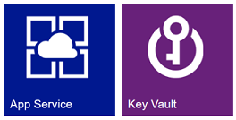
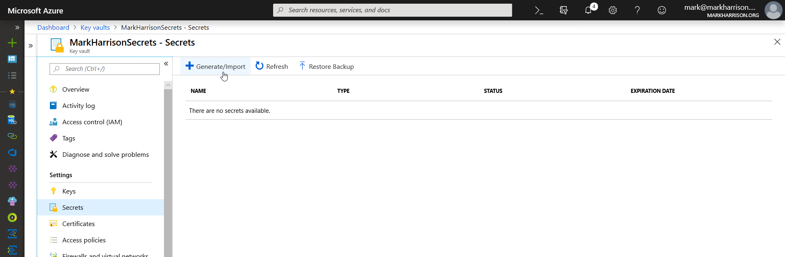
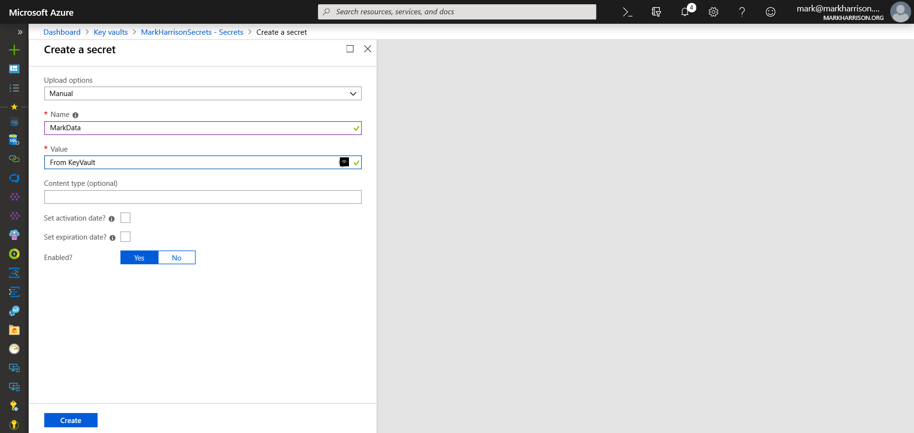
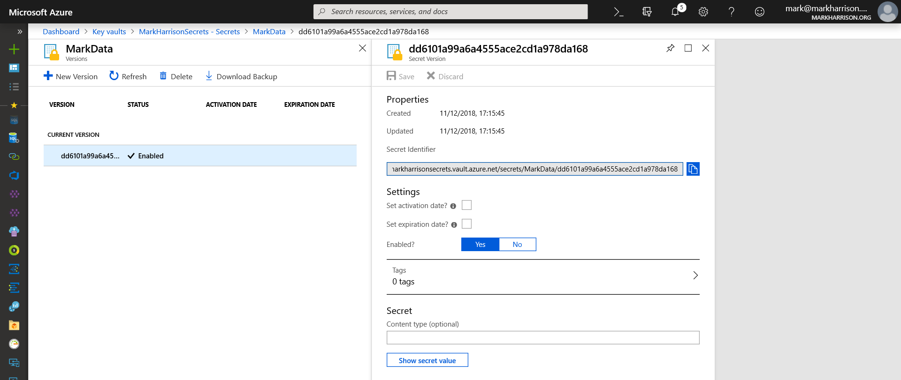
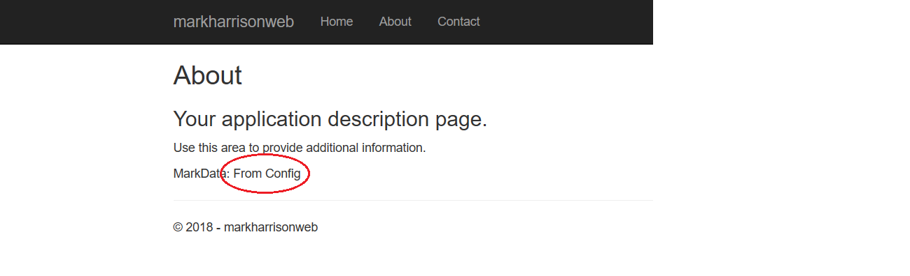
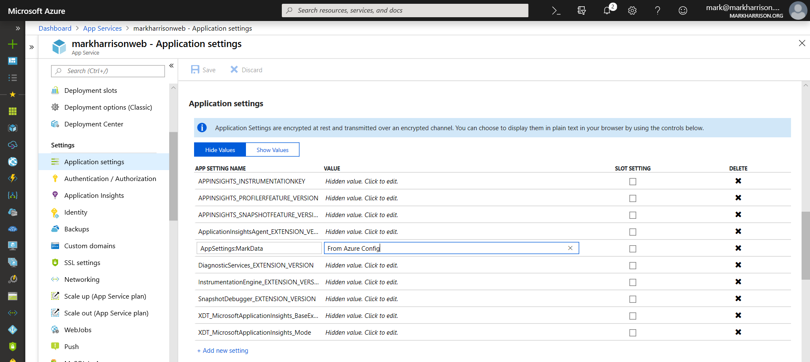
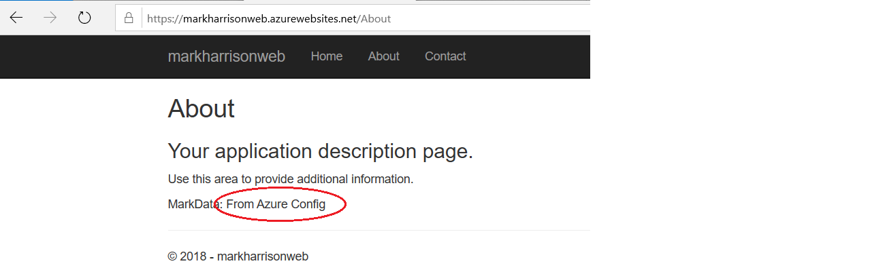
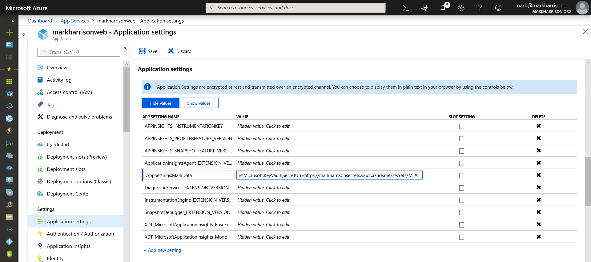
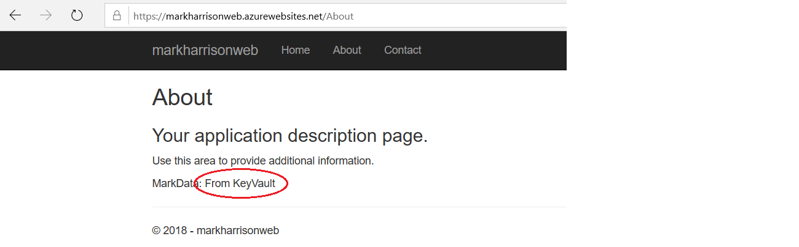

# Setup Azure App Service configuration using Key Vault

Mark Harrison : 11 Dec 2018



- [Setup Azure App Service configuration using Key Vault](AppSvcKV-1.md) ... this document

## Overview

This document shows how to enable App Service to read configuration value(s) from Azure Key Vault, which is a service that provides centralized secrets management, with full control over access policies and audit history.

This will use a Managed Service Identity from Azure Active Directory which enables the AppService to access other AAD-protected resources such as Azure Key Vault.

## Prerequisites

Create an Azure App Service.

Create an Azure Key Vault.

Create a .Net Core web app e.g. using the template in Visual Studio.

## Web App configuration providers

App configuration in .NET Core is based on key-value pairs established by configuration providers.

For this example, our Web App configuration value will be obtained from one of three different options:

- AppSettings JSON file stored on the file system
- Environment variables - set via Application Settings in the Azure portal
- Key Vault - set via Application Settings in the Azure portal

The Application Settings in the Azure portal will take precedence over any set in the JSON file.

In our .NET project is a file called appsettings.json. Add a section to this called `AppSettings` and with a Name / Value pair - as below.  Note the `MarkData` item.

```text
{
  "Logging": {
    "LogLevel": {
      "Default": "Warning"
    }
  },
  "AllowedHosts": "*",
  "AppSettings": {
    "MarkData": "From Config"
  },
  "ApplicationInsights": {
    "InstrumentationKey": "1494dbfa-a18e-496d-97af-690eae78da65"
  }
}
```

### Web App code

Need to make a few additions to our Web App code to read the config and display on a web page.

Create a class to store configuration values - this is used by the dependency injection to allow the Razor views to access the configuration.

```text
namespace markharrisonweb.Configuration
{
    public class Configx
    {
        public string MarkData { get; set; }
    }
}
```

The following code needs to be added to the Startup processing to define the Configuration providers, and the precedence sequence.

Also the `services.Configure` call which loads up the configuration values for dependency injection.

```text
using markharrisonweb.Configuration;

        public Startup(IHostingEnvironment env)
        {
            var builder = new ConfigurationBuilder()
                .SetBasePath(env.ContentRootPath)
                .AddJsonFile("appsettings.json", optional: true, reloadOnChange: true)
                .AddJsonFile($"appsettings.{env.EnvironmentName}.json", optional: true)
                .AddEnvironmentVariables();
            Configuration = builder.Build();
        }

        public void ConfigureServices(IServiceCollection services)
        {
            services.Configure<Configx>(Configuration.GetSection("AppSettings"));
            services.AddMvc().SetCompatibilityVersion(CompatibilityVersion.Version_2_1);
        }
```

Amend a Razor view to display our configuration value

```text
@page
@using markharrisonweb.Configuration;
@using Microsoft.Extensions.Options;

@inject IOptions<Configx> OptionsConfig;

@model AboutModel
@{
    ViewData["Title"] = "About";
}
<h2>@ViewData["Title"]</h2>
<h3>@Model.Message</h3>

MarkData: @Html.Raw(OptionsConfig.Value.MarkData)
```

Publish the Web App to our Azure App Service

## Enable Managed Identity for App Service

Create a Managed Service Identity for the App Service. Select the `Identity` menu item on the navigation blade.


Switch to the Key Vault management to enable a policy that allows the Managed Service identity an access policy to Get secrets.  Select the `Access Policies` menu item on the navigation blade.

Select `Add User`


Search for and select the App Service to which we created a MSI.


Set permissions to allow 'Get' of secrets.


Create the policy.


## Set configuration value in Key Vault

Create a Configuration item as a secret in Key Vault.



Enter the secret name and value e.g. set value to `"From KeyVault"`.



Display the secrets URI - will need this shortly, so make a copy.



## Web App configuration

### Web App configuration from JSON

Access the Web App - and navigate to the view displaying the configuration settings.

Note that the configuration value displayed is `"From Config"` i.e. taken from the appsettings.json file.



### Web App configuration from Environment Variable

Set the Application Settings in the Azure Management Portal.

- Setting Name = "AppSettings:MarkData"
- Setting Value = "From Azure Config"



Access the Web App - and navigate to the view displaying the configuration settings.

Note that the configuration value displayed is `"From Azure Config"` i.e. taken from the Azure environment variables / application settings.



### Web App configuration from Key Vault

Amend Application Settings in the Azure Management Portal:

- Setting Name = "AppSettings:MarkData"
- Setting Value = "@Microsoft.KeyVault(SecretUri=xxx)"
  - e.g. SecretUri=https://markharrisonsecrets.vault.azure.net/secrets/MarkData/dd6101a99a6a4555ace2cd1a978da168



Access the Web App - and navigate to the view displaying the configuration settings.

Note that the configuration value displayed is `"From KeyVault"`.



## Summary

This document demonstrated shows how App Service can work with secrets stored in Azure Key Vault without requiring any code changes. Azure Key Vault is a service that provides centralized secrets management, with full control over access policies and audit history.

---
<http://github.markharrison.io>
